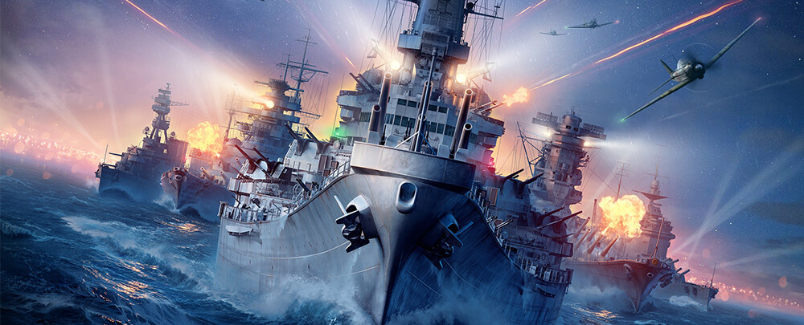

Bienvenue,

Ce projet va permettre à deux joueurs de s'affronter à la bataille navale


- Chaque jeu est composé de 3 océans différents avec chacun des dimensions différentes:
l’océan atlantique de taille 6 × 7 ;
l’océan pacifique de taille 7 × 8 ;
l’océan Indien de taille 5 × 6.

- Chaque océan comporte des îles placées automatiquement:
l'océan Atlantique a l'île des Açores aux coordonnées : (0,0), (0,1), (1,0), (1,1)
l'océan Pacifique a l'île de Hawaii aux coordonnées : (4,5), (4,6), (4,7), (3,7)
l'océan Indien a l'île de la Réunion aux coordonnées : (2,1), (2,2), (2,3), (2,4)

La partie se passera de la façon suivante :

- Les deux joueurs doivent donner leur nom

- On choisit le mode de difficulté :
Facile : nombre de tirs illimité;
Normal : nombre de tirs limité à 65;
Difficile : nombre de tirs limité à 50;
Extrême : nombre de tirs limités à 40.

- Chaque joueur place ses bateaux, en choisissant dans quel océan puis en rentrant les coordonnées de leur bateau.

- Chaque joueur aura 5 bateaux : un de taille 4, deux de taille 3, un de taille 2, et un de taille 1.

- Une fois les bateaux placés, chaque joueur va tirer a tour de rôle en choisissant un océan puis les coordonnées de l'emplacement où il veut tirer. 

- Tant que tout les bateaux ne sont pas coulés et qu'il reste des tirs, le programme demandera aux joueurs de tirer

- Après avoir tiré, l'algorithme indiquera : 
    🔹 Touché : Si la position visée est occupée par un bateau et que le bateau n'est pas encore coulé
    🔹 Coulé : Si la position visée est la dernière case d'un bateau
    🔹 En vue : Si la position visée ne touche pas de bateau mais qu'un bateau est sur la même ligne ou colonne que la position
    🔹 À l'eau : Dans les autres cas

- La partie se termine quand tout les bateaux d'un joueur sont coulés (victoire de l'autre joueur) ou qu'il ne reste plus de tirs. Si à la fin chaque joueur possède encore au moins un bateau, il y a égalité.

Taper la commande : " swift *.swift " , pour compiler tous les protocoles. Ensuite, taper la commande : "./main " pour éxécuter le programme.

Bon jeu !


Projet réalisé par
Tom Philippe : @tom.philippe
Sirine Yakhou : @sirine.yakhou
```
